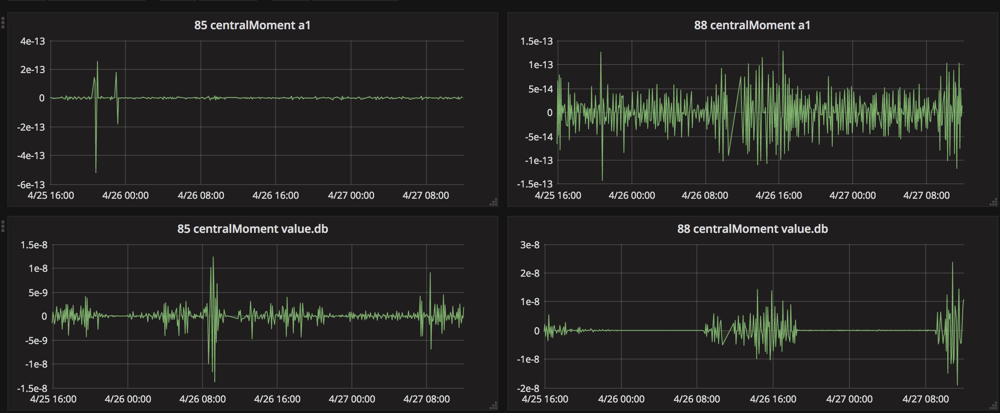
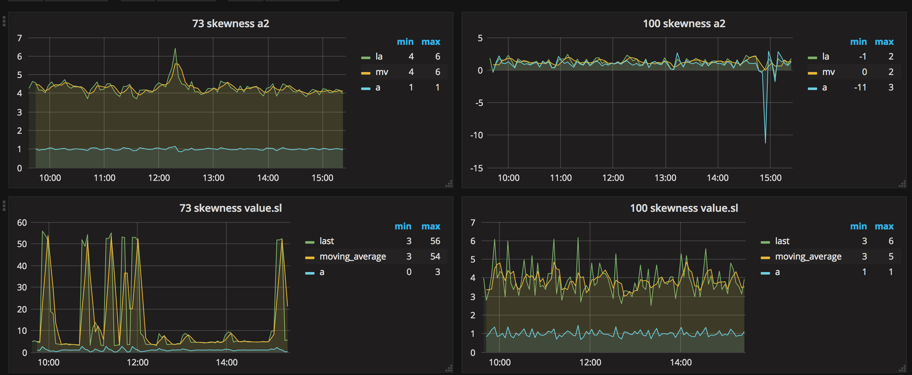

# Hunting ..

* MOLOCH has API, see https://github.com/aol/moloch/wiki/API


## .. known good

see https://github.com/ccdcoe/otta

## .. unknown


> tule eile meile
>> uniq -c | cut -f1

```bash

 for vlan in 100 101 102 103
 do
  for field in tipv62-term tipv61-term a2 a1 p1 p2 pa pa1 pa2 sl db db2 db1
  do
  echo "$vlan $field"
  end=$(date --date='2 minutes ago' +%s)
  start=$(date --date='12 minutes ago' +%s)
  time=$(echo "startTime=$start&stopTime=$end")
  curl -m 2 -s --digest -uadmin:admin  "http://10.0.6.2:8005/unique.txt?$time&expression=databytes.src%3E0%26%26databytes.dst%3E0%26%26vlan%3D$vlan&field=$field&counts=1" > $vlan.$field.txt
  [ $? -eq 0 ] || break
  cut -f2 -d, $vlan.$field.txt | node calculates_stats.js $vlan $field
  if [[ "$field" = "sl" ]] || [[ "$field" = "pa" ]] || [[ "$field" = "pa1" ]] || [[ "$field" = "pa2" ]] || [[ "$field" = "db" ]] || [[ "$field" = "db1" ]] || [[ "$field" = "db2" ]];
  then
    ff=$(echo "value.$field")
    cut -f1 -d, $vlan.$field.txt | node calculates_stats.js $vlan $ff
    echo $ff
  fi
  sleep 1
  done
 done

```

```javascript
// read mfield name as argument
// read datapoints from stdin
// calculate standard stat functions
// and send to influxdb
// sorry, influxdb is hardcoded

if ( process.argv[2] ){
	tvlan = process.argv[2];
} else {
  console.error('missing vlan tag name');
  process.exit(1);
}
if ( process.argv[3] ){
	tfield = process.argv[3];
} else {
  console.error('missing field tag name');
  process.exit(1);
}
//console.dir(mfield);
var atoll = require('./atoll.js');

function _atollNumericFunctions(){
		var ret = {};
		var obj = atoll([1,2,3,4,5,6]);
		for (var prop in obj) {
			if (typeof(obj[prop]) === 'function') {
				try {
					var tmp = obj[prop]();
				} catch(err) {
					//noop
				} finally {
					if ( typeof(tmp) === 'number') {
						ret[prop] = NaN;
					}
				}
			}
		}
		return ret;
	}

var functions = _atollNumericFunctions();

const Influx = require('influx');
const influx = new Influx.InfluxDB({host: 'localhost',database: 'ls17'});
var fs = require("fs");
fs.readFile("/dev/stdin", "utf8", function(error, contents) {
  var a = contents.split("\n");
  a.pop();
  var stat = atoll(a.map(Number),true);
  var measures = {}
  for (var f in functions) {
    var value = stat[f]();
    if (value != 0 && value != Infinity && value != -Infinity && !isNaN(value) ) {
      measures[f] = stat[f]();
    }
  }
  influx.writeMeasurement('moloch_stats', [{tags: { vlan: tvlan, field: tfield}, fields: measures}]);
});
```

see also https://github.com/hillar/atoll.js




