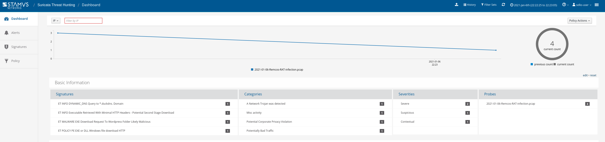

# SELKS

## On docker

Simply clone the SELKS public repository.

```
git clone https://github.com/StamusNetworks/SELKS.git
```

Enter the docker folder.

```
cd SELKS/docker
```

Use `easy-setup.sh` script to prepare docker environment. It will prompt with a number of questions, including. Install what is needed.

```
sudo ./easy-setup.sh --es-memory 1G --ls-memory 1G
```

Note that this command limits Elasticsearch and Logstash memory to 1GB RAM.

At the end of this run you will have:
* docker installation;
* docker-compose;
* portainer for managing docker containers (if enabled);
* prepared data for containers;
* af-packet interface capture config for suricata;
* environment setup for Elastic and Logstash memory caps;

Alternatively, script can also be executed non-interactively with most options passed via command line. Make sure that interface `-i` matches something that exists on your system.

```
sudo ./easy-setup.sh  --non-interactive -i tppdummy0 --iA --es-memory 1G --ls-memory 1G
```

Refer to live capture section on for how to set up a virtuan NIC for replays.

Once setup is done, spin up containers with docker-compose.

```
sudo docker-compose up -d
```

To see the logs either omit the `-d` to call it in foreground or see the backend logs.

```
sudo docker-compose logs --follow
```

Once done, navigate to `https://192.168.56.13/` if using embedded vagrant env. Otherwise visit port 443 on whatever box was used. Default credentials are `selks-user:selks-user`.

## Reading PCAPs

`SELKS/docker/scripts` folder has a helper for reading PCAP files.

```
./scripts/readpcap.sh -h
Pcap reading script through Suricata
Usage: ./scripts/readpcap.sh [-c|--(no-)cleanup] [-a|--(no-)autofp] [-s|--set-rulefile <arg>] [-S|--set-rulefile-exclusive <arg>] [-h|--help] [--] <path>
        <path>: Path to the pcap file to read. If <path> specifies a directory, all files in that directory
                will be processed in order of modified time maintaining flow state between files.
        -c, --cleanup, --no-cleanup: Remove all previous data from elasticsearch and suricata. (off by default)
        -a, --autofp, --no-autofp: Run in autofp mode instead of single mode. (off by default)
        -s, --set-rulefile: Set a file with signatures, which will be loaded together with the rules set in the yaml. (no default)
        -S, --set-rulefile-exclusive: Set a file with signatures, which will be loaded exclusively, regardless of the rules set in the yaml. (no default)
        -h, --help: Prints help

Usage: readpcap.sh [OPTIONS] <path>
```

To read a single PCAP file in Suricata `autofp` mode, use following command. Note the `-c` flag which also cleans up any previously existing data.

```
sudo ./scripts/readpcap.sh -ac /data/2021-01-06-Remcos-RAT-infection.pcap
```

By navigating to **hunt** section and selecting **all** from **time picker**, you should see something like this.



## Tasks

* get SELKS up and running
* import `2021-01-06-Remcos-RAT-infection`
  * what is the malicious domain used for stage1?
  * find the malicious EXE
  * what is the IP used to serve it?
* import `2021-01-05-PurpleFox-EK-and-post-infection-traffic`
  * what is the IoC for malicious host?
  * look into `flow` records, does anything seem strange?
* import `2022-01-01-thru-03-server-activity-with-log4j-attempts`
  * find encoded log4j script injection
  * decode it
