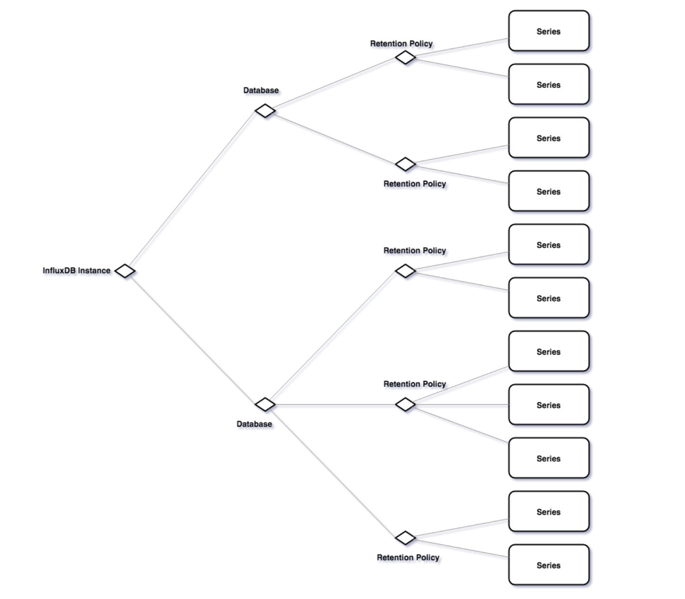

# Continuous Queries (CQ) and Retention Policies (RP)

## Continuous Queries
* Continuous queries are queries that will periodically run on data in InfluxDB.
* They're somewhat similar to running queries with cron.
* They're used to "downsample" data or pre-calculate common queries.

### Format
```
CREATE CONTINUOUS QUERY [name_of_continuous_query] ON [name_of_db]
[RESAMPLE [EVERY interval] [FOR interval]]
BEGIN
  SELECT [inner_part_of_select]
  INTO [new_measurement]
  FROM [measurement]
  GROUP BY time([frequency]), [tags]
END
```

* The EVERY clause specifies how frequently the CQ will run.
* The FOR clause specifies how far back the CQ resamples.

### Add this CQ
```
CREATE CONTINUOUS QUERY downsample_cpu_1m ON telegraf BEGIN
  SELECT
  min(usage_idle),
  mean(usage_idle),
  max(usage_idle),
  INTO downsampled_cpu
  FROM cpu
  GROUP BY time(60s) *
END
```

```
$ influx
> CREATE CONTINUOUS QUERY downsample_cpu_1m ON telegraf BEGIN SELECT min(usage_idle), mean(usage_idle), max(usage_idle) INTO downsampled_cpu FROM cpu GROUP BY time(60s), * END
```

### Verify that it exists

```
SHOW CONTINUOUS QUERIES
```

## Retention policies
* A retention policy describes how long the data should be stored in the database. (DURATION)
* A retention policy belongs to a database.

### Format

```
CREATE RETENTION POLICY [name_of_policy]
ON [name_of_database]
  DURATION [time_duration]
  REPLICATION [number] [DEFAULT]
```

### Example
```
CREATE RETENTION POLICY "1h" ON newdb DURATION 1h REPLICATION 1 DEFAULT
```

### Verify
```
SHOW RETENTION POLICIES ON newdb
```

## Combining CQs and RPs

```
CREATE CONTINUOUS QUERY new_downsample_cpu_1m ON telegraf BEGIN
  SELECT
  min(usage_idle),
  mean(usage_idle),
  max(usage_idle),
  INTO "newdb"."1h"."downsampled_cpu""
  FROM cpu
  GROUP BY time(60s) *
END
```

```
$ influx
> CREATE CONTINUOUS QUERY new_downsample_cpu_1m ON telegraf BEGIN SELECT min(usage_idle), mean(usage_idle), max(usage_idle) INTO newdb."1h".downsampled_cpu FROM cpu GROUP BY time(60s), * END
```

## Verify that its working

```
$ influx
> use newdb
> show measurements
```

## Full picture of DB/RP/CQ

