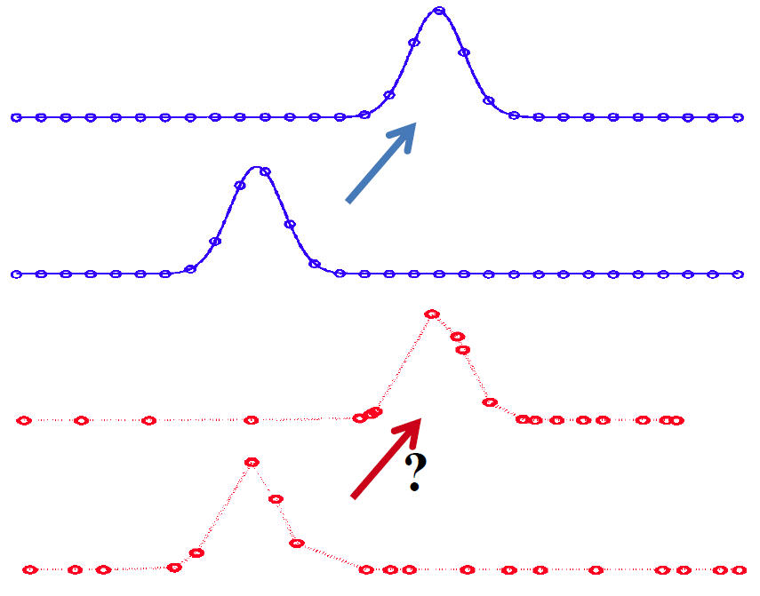
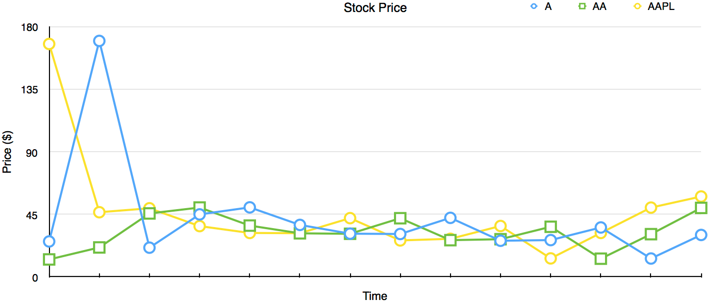
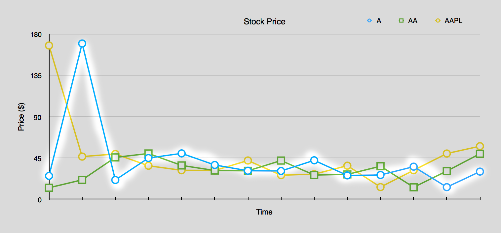

# InfluxDB Data Model

InfluxDB is a time series database.

## Time series Data
A time series is a sequence of data points, typically consisting of successive measurements made from the same source over a time interval.
What this essentially means is that if you were to plot the points on a graph, one of your axes would always be time.

There are two types of time series. Regular and Irregular.



InfluxDB and TICK stack allow for both types.

## Data Model



**Measurement**: `stock`

Measurement is a high level grouping for the data.

**Tags**: `ticker=A`, `ticker=AA`, `ticker=AAPL`, `market=nasdaq`, `market=nyse`

Tags are indexed values. Tag keys and values are only ever strings. A single point can have as many tags as is needed.

**Tagset**: `ticker=A,market=nasdaq`, `ticker=AA,market=nyse`, `ticker=AAPL,market=nasdaq`

Tagset is all tags for a particular legend item.

**Fields**: `price=177.03`, `price=32.10`, `price=35.52`

Fields are the actual data. They can be integers, floating point, strings, and booleans.  A single point can have as many fields as is needed.

**Fieldset**: `price=177.03,volume=100`, `price=32.10,volume=501`, `price=35.52,volume=123`

Field set is all fields under a common measurement at a given time.

**Timestamp**: `14452992000000000`, `14452993000000000`, `14452994000000000`

Timestamp is the number of nanoseconds since January 1st, 1970 00:00.

### Line protocol

We represent points in what is called like protocol

**measurement,tagset fieldset timestamp**

```
stock,ticker=A,market=nasdaq price=177.03,volume=100 14452992000000000

stock,ticker=AA,market=nyse price=32.10,volume=501 14452992000000000

stock,ticker=AAPL,market=nasdaq price=35.52,volume=123 14452992000000000
```

### Series
A series is defined by a combination of a **measurement** and **tagset**.



**measurement,tagset**

```
stock,ticker=A,market=nasdaq

stock,ticker=AA,market=nyse

stock,ticker=AAPL,market=nasdaq
```

##### Exercise 1
Do the following points belong to the same series?

```
stock_price,ticker=NN value=100 1445299200000000000

stock_price,ticker=NN other=10 1445299200000000000

stock_price,ticker=NN value=101,other=11 1445299200000000000
```

##### Exercise 2
Express a point under the same measurement as the example below

```
stock_price,ticker=AAPL,market=NASDAQ value=1032 1445299200
```

### Databases
All points in InfluxDB are contained in a logical container called a **database**. In practice, a single InfluxDB instance may contain hundreds of databases.

-----

-> Next [Writing Data](createDB.md)
