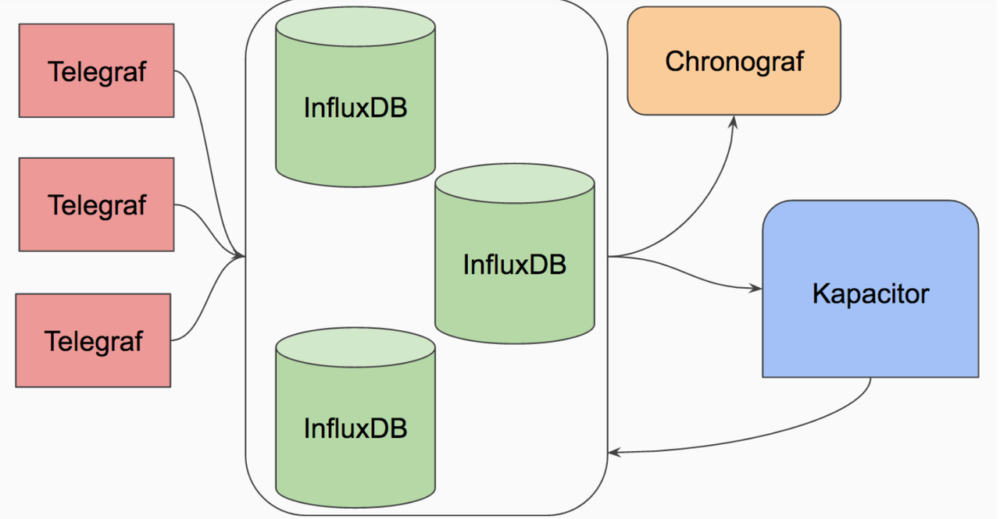

# Kapacitor

> Kapacitor is InfluxDB's native stream and batch data processing engine.

* https://www.influxdata.com/time-series-platform/kapacitor/
* https://docs.influxdata.com/kapacitor/v1.2/
*  https://github.com/influxdata/kapacitor

Featrues:
* Process both streaming data and batch data.
* Alert to external system
* write back to InfluxDB
* UDFs

For processing Kapacitor needs **TICKscripts**.  

------
-> Next [Install](install.md)
