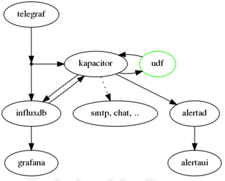

# Singlehost TICKAG



* Telegraf
* InfluxDB
* Chronograf
* Kapacitor
* Alerta
* Grafana

## Provision scipt

see https://github.com/ccdcoe/CDMCS/blob/master/TICK/vagrant/singlehost/Vagrantfile

```

root@TICKAlerta:~# netstat -ntple
Active Internet connections (only servers)
Proto Recv-Q Send-Q Local Address           Foreign Address         State       User       Inode       PID/Program name
tcp        0      0 127.0.0.1:27017         0.0.0.0:*               LISTEN      113        24321       1273/mongod     
tcp        0      0 0.0.0.0:80              0.0.0.0:*               LISTEN      0          27880       2313/nginx -g daemo
tcp        0      0 0.0.0.0:8080            0.0.0.0:*               LISTEN      0          24916       1993/python     
tcp        0      0 0.0.0.0:22              0.0.0.0:*               LISTEN      0          22484       1212/sshd       
tcp6       0      0 :::22                   :::*                    LISTEN      0          22486       1212/sshd       
tcp6       0      0 :::8086                 :::*                    LISTEN      998        15565       1280/influxd    
tcp6       0      0 :::3000                 :::*                    LISTEN      112        25681       1958/grafana-server
tcp6       0      0 :::8088                 :::*                    LISTEN      998        13996       1280/influxd    
tcp6       0      0 :::8888                 :::*                    LISTEN      996        13759       1270/chronograf
tcp6       0      0 :::9092                 :::*                    LISTEN      997        15026       1220/kapacitord

```
